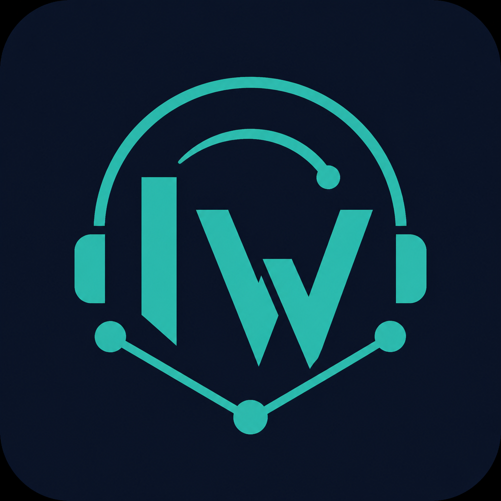
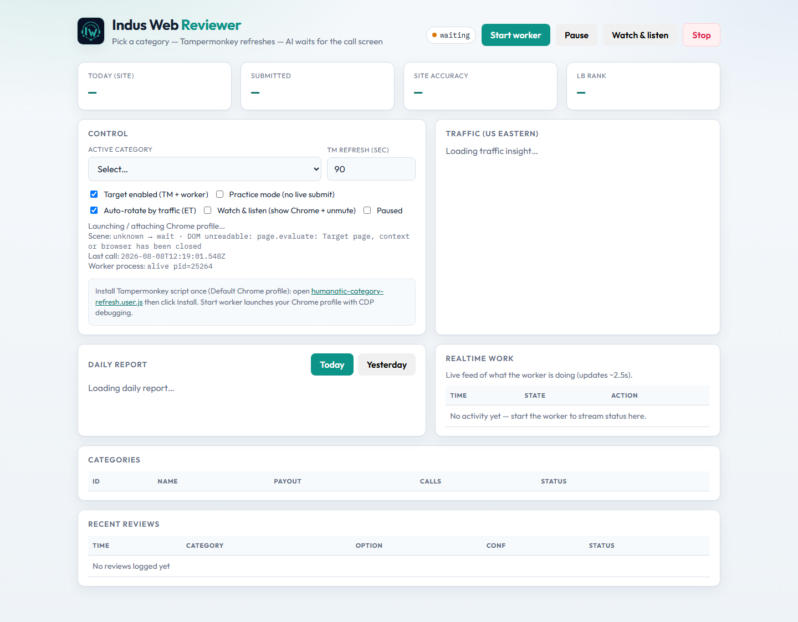

<p align="center">
  
</p>

# Indus Web Reviewer

Local Electron dashboard and wait-mode worker for Humanatic call reviews. It uses your local Chrome profile via Playwright/CDP, with Grok and Whisper support for assisted review decisions.

> This is a local tool. Keep API keys and Chrome-profile configuration in `.env`; never commit that file.

## Dashboard

<p align="center">
  
</p>

The dashboard brings worker controls, review activity, category queues, daily reporting, and site traffic into one place.

## Highlights

- Electron desktop application with a browser dashboard option
- Wait-mode worker that attaches to or launches your configured Chrome profile
- Category selection, worker controls, queue rotation, and realtime status
- Practice mode for safe testing before live submission
- Audio-first transcript handling with optional Grok and Whisper assistance
- Tampermonkey helper scripts installed automatically when the worker starts

## Requirements

- Windows, macOS, or Linux with Node.js 20+
- Google Chrome and an authenticated Humanatic profile
- A Grok-compatible API key for AI-assisted decisions (optional for dashboard-only use)

## Quick start

```bash
npm install
npm run web:install
Copy-Item .env.example .env
# Edit .env with your Chrome profile path and API key(s)
npm run app
```

This builds the dashboard, starts the local Control API, and opens **Indus Web Reviewer** in an Electron window.

## Configuration

Start with `.env.example`. The most important settings are:

| Setting | Purpose |
| --- | --- |
| `PRACTICE_MODE=1` | Safe select-only mode; set `0` only when live submission is intended. |
| `CHROME_USER_DATA_DIR` | Path to the local Chrome user-data directory. |
| `CHROME_PROFILE_DIRECTORY` | Chrome profile name, normally `Default`. |
| `SKIP_ANTI_DETECTION=1` | Enables the expected local Chrome connection path. |
| `GROK_API_KEY` | AI assistance key; Groq `gsk_` keys are also supported for chat and Whisper routing. |

## Wait-mode flow

1. Configure your Chrome profile and API key(s) in `.env`.
2. Start the desktop app with `npm run app` (or use `npm run dashboard` for the browser dashboard).
3. On first worker use, the helper userscripts are automatically loaded. To pre-download the userscript manager, run `npm run tm:ensure` once.
4. Select a category and choose **Start worker**. The worker opens or attaches to Chrome, then navigates through Category List to **REVIEW**.
5. When queues are empty, automatic rotation follows the configured US Eastern traffic windows.

## Commands

| Command | Purpose |
| --- | --- |
| `npm run app` | Build and open the Electron desktop app. |
| `npm run app:dev` | Electron app with Vite hot reload. |
| `npm run dashboard` | Control API and browser dashboard. |
| `npm run api` | Control API on port `3847`. |
| `npm run web` | Vite dashboard on port `5173`. |
| `npm run worker:wait` | Run only the wait-mode worker. |
| `npm run tm:ensure` | Pre-download the userscript manager. |
| `npm run check` | Type-check and run the offline verification suite. |

## Troubleshooting

### Electron window is blank or the API is unavailable

Run `npm run build:web` once, then make sure nothing else is using port `3847`.

### Chrome login loops

Disable older Tampermonkey scripts that deep-link to `category_selector`. This worker follows the supported Category List to REVIEW flow instead.

### Dashboard does not show expected profile data

Confirm `CHROME_USER_DATA_DIR` and `CHROME_PROFILE_DIRECTORY` point to the Chrome profile you actually use, then restart the worker.

## Safety

Use `PRACTICE_MODE=1` while configuring or validating the tool. Switching to live submission is an explicit local configuration decision and should be made only after you have verified the category, Chrome profile, and review flow.
